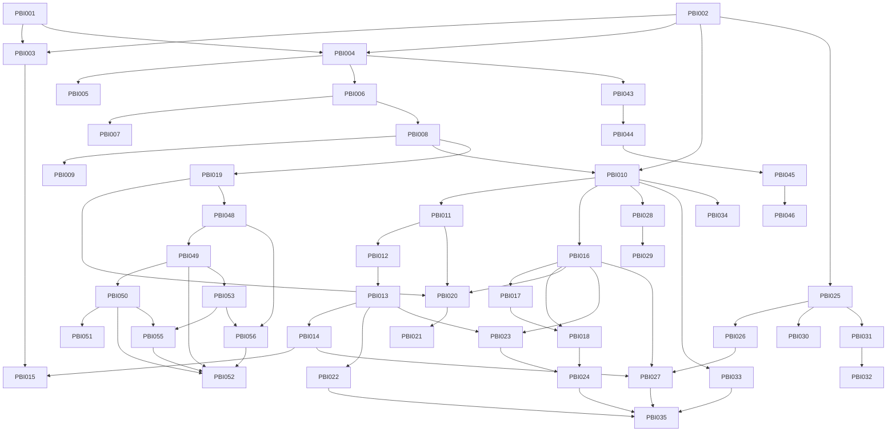

# Plans — SWE Drip V1

> Sequencing index for `asdlc-plan` / `asdlc-execute`. One PBI per task card; dependency graph drives Ralph Loop order. **13 specs / 35 PBIs** derived from the v1.0 delivery spec (Phases 1–7) + the Settings/Agents scope correction (FR-17/18/19).

## Plane sync

Bound to Plane: **kcb / SWDRP (d162b6d4-1205-4eea-9ef3-871354c5e8a3)** — verified via MCP `plane-kcb` 2026-09-13.
Backlog ignored until moved to `Todo` — only `Todo` issues are candidate feature inputs; every planned PBI is pushed as a `Todo` issue and linked in its card (`Plane: kcb/SWDRP-N`).

- 2026-09-13: onboarding seed pull — 0 `Todo` issues found (project created same day)
- 2026-09-13: push-create — 35 issues created in `kcb/SWDRP` (`Todo`), linked in each PBI card (`Plane: kcb/<identifier>`); range SWDRP-1 … SWDRP-35
- Next sync: `asdlc-execute` moves issues through `In Progress` → `In Review` → `Done` with resolution comments; `asdlc-plane` strictly scoped to `kcb/SWDRP`

## Spec index

| Spec | Source | Contracts | PBIs |
|---|---|---|---|
| `specs/app-foundation/spec.md` | technical spec (stack/toolchains) | 6 (layout, brand shell, health, single root gate, secrets discipline, local dev DB) | PBI-001…003 |
| `specs/auth-rbac/spec.md` | PRD §2, FR-23/24, Tech §4, A1 | 5 (single auth runtime, server-side RBAC, admin-only user mgmt, session safety, A1 evidence) | PBI-004…005 |
| `specs/audit-log/spec.md` | FR-20/21/22, A2, CC-3 | 6 (append-only, actor binding, filter/export, A2, chain reconstruction, no secrets) | PBI-006…007 |
| `specs/dashboard/spec.md` | FR-1/2/3, A3 | 5 (stat cards, real data path, activity feed, one approvals source, no fabricated data) | PBI-008…009 |
| `specs/pipeline-core/spec.md` | Vision §3.2/3.3, Data §1.3/§3, A4–A6 | 10 (state schema, 11 nodes config-HITL, per-node routing, cost logging, A5, A6, A4 parity, deterministic placement, QC policy, shelf invariants) | PBI-010…015 |
| `specs/hitl-approvals/spec.md` | FR-11, Tech §6, A7 | 6 (one queue, decision→resume, A7, audited, SSE live, RBAC) | PBI-016…018 |
| `specs/collections/spec.md` | FR-4…7, Data §1.1, A8/A9 | 6 (YAML single source, CRUD, candidates + A8, retire + survivor A9, audited, validation) | PBI-019…021 |
| `specs/design-qc/spec.md` | Vision §6, FR-12…14, A10–A12 | 6 (A10, design detail API, A12, calibration A11, QC screen, audited decisions) | PBI-022…024 |
| `specs/fourthwall-integration/spec.md` | Vision §4, Data §4, A13–A15 | 7 (reads, A13 spike, single write path, A14, A15, invariants first, secrets) | PBI-025…027 |
| `specs/traceability/spec.md` | FR-8…10, A16/A18 | 6 (runs list, run detail, replay A18, chain A16, authz+audit, single source) | PBI-028…029 |
| `specs/catalog-analytics/spec.md` | FR-15/16, A17 | 6 (catalog mirror, KPI series, A17 webhook, retirement recs, webhook integrity, read/write discipline) | PBI-030…032 |
| `specs/settings-agents/spec.md` | FR-17/18/19, NFR-2 | 6 (HITL toggles, brand lock, integrations status, agents roster, single config source, RBAC) | PBI-033…034 |
| `specs/hitl-graduation/spec.md` | Vision §6.4, A19 | 5 (A19 record, evidence minimums, founder authority, reversibility, traceability) | PBI-035 |
| `specs/operator-mcp/spec.md` | founder request 2026-09-16 (agent-operated doorway) | 6 (token auth, read parity, writes reuse enforcement, graph visibility w/o mutation, secrets, same deployable) + token management UI | PBI-043…047 |
| `specs/collection-research/spec.md` | founder request 2026-09-16 (creative pillar) | 6 (named styles, visual contract v2, inspiration ingest, research graph, coherence within, diversity between) + durable artifacts | PBI-048…053 |

## Execution order

| Order | PBI | Spec | Depends on | State | Plane | Summary |
|---|---|---|---|---|---|---|
| 1 | PBI-001 | app-foundation | none | In Review | SWDRP-1 | CP scaffold: Next.js 15 + shadcn brand shell + ADR-002 |
| 2 | PBI-002 | app-foundation | none | Done | SWDRP-2 | API scaffold: pyproject + FastAPI health + pipeline package |
| 3 | PBI-003 | app-foundation | 001, 002 | In Review | SWDRP-3 | Polyglot gates + local Postgres compose + AGENTS.md §2/§5 |
| 4 | PBI-004 | auth-rbac | 001, 002 | In Review | SWDRP-4 | Better Auth runtime + FastAPI validation + RBAC + ADR-003 |
| 5 | PBI-005 | auth-rbac | 004 | In Review | SWDRP-5 | Login + Users & Roles UI + user mgmt endpoints |
| 6 | PBI-006 | audit-log | 004, 002 | In Review | SWDRP-6 | Audit writer + read API + auth-event hook |
| 7 | PBI-007 | audit-log | 006 | In Review | SWDRP-7 | Audit log viewer + export UI |
| 8 | PBI-008 | dashboard | 006, 004 | In Review | SWDRP-8 | Dashboard summary API (+ model_calls migration) |
| 9 | PBI-009 | dashboard | 008, 001 | In Review | SWDRP-9 | Dashboard UI (cards, feed, pending top) |
| 10 | PBI-010 | pipeline-core | 002, 008 | In Review | SWDRP-10 | State + graph skeleton + OpenRouter client + routing + costs |
| 11 | PBI-011 | pipeline-core | 010 | In Review | SWDRP-11 | Nodes 1-2: trend/clustering + contract interrupt |
| 12 | PBI-012 | pipeline-core | 011 | In Review | SWDRP-12 | Nodes 3-5: copy, design spec, render |
| 13 | PBI-013 | pipeline-core | 012 | In Review | SWDRP-13 | Nodes 6-8: placement, aesthetic QC + regen, technical QC |
| 14 | PBI-014 | pipeline-core | 013 | In Review | SWDRP-14 | Nodes 9-11: FW draft create, publish gate, shelf |
| 15 | PBI-015 | pipeline-core | 014, 003, 010 | In Review | SWDRP-15 | Parity harness + checkpointer + routing audit (A4/A5/A6) |
| 16 | PBI-016 | hitl-approvals | 010, 004, 006 | In Review | SWDRP-16 | Resume service + approvals queue API |
| 17 | PBI-017 | hitl-approvals | 016 | In Review | SWDRP-17 | SSE stream |
| 18 | PBI-018 | hitl-approvals | 016, 017, 001 | In Review | SWDRP-18 | Approvals screen |
| 19 | PBI-019 | collections | 004, 006, 008 | Done | SWDRP-19 | YAML store + CRUD API |
| 20 | PBI-020 | collections | 019, 016, 011 | In Review | SWDRP-20 | Lifecycle: candidates, approve (A8), retire + survivor (A9) |
| 21 | PBI-021 | collections | 020, 001 | In Review | SWDRP-21 | Collections UI |
| 22 | PBI-022 | design-qc | 013 | In Review | SWDRP-22 | Rubric calibration suite (A10) + regen evidence (A12) |
| 23 | PBI-023 | design-qc | 016, 013, 010 | Done | SWDRP-23 | Design detail + calibration API |
| 24 | PBI-024 | design-qc | 023, 018, 001 | In Review | SWDRP-24 | Design QC screen |
| 25 | PBI-025 | fourthwall-integration | 002 | In Review | SWDRP-25 | FW MCP read client |
| 26 | PBI-026 | fourthwall-integration | 025 | In Review | SWDRP-26 | Product-create spike + ADR-004 (A13, manual) |
| 27 | PBI-027 | fourthwall-integration | 026, 014, 016, 025 | Blocked | SWDRP-27 | Publish cutover + old-path check (A14/A15, manual) |
| 28 | PBI-028 | traceability | 010, 004, 006 | In Review | SWDRP-28 | Runs + replay API (A18) |
| 29 | PBI-029 | traceability | 028, 001 | In Review | SWDRP-29 | Runs UI (tracker, inspector, replay) |
| 30 | PBI-030 | catalog-analytics | 025, 004, 001 | Done | SWDRP-30 | Catalog mirror API + screen |
| 31 | PBI-031 | catalog-analytics | 025, 019, 004, 001 | Todo | SWDRP-31 | KPI analytics API + dashboards |
| 32 | PBI-032 | catalog-analytics | 031, 025 | Todo | SWDRP-32 | FW webhook + analytics trigger (A17) |
| 33 | PBI-033 | settings-agents | 004, 006, 010, 001 | Todo | SWDRP-33 | Settings: HITL toggles, brand lock, integrations |
| 34 | PBI-034 | settings-agents | 010, 008, 004, 006, 001 | Todo | SWDRP-34 | Agents roster + budget caps (FR-17) |
| 35 | PBI-035 | hitl-graduation | 033, 022, 027, 024 | Todo | SWDRP-35 | Graduation decision record (A19, manual) |
| 36 | PBI-036 | — (deploy hardening) | 001–034 | In Review | SWDRP-36 | Coolify deployment + production bug fixes (11 defects) |
| 37 | PBI-037 | pipeline-runs | 028, 010, 033, 016 | In Review | SWDRP-37 | **Run initiation** — `POST /api/runs` (the pipeline's missing entry point) |
| 38 | PBI-038 | agent-control-plane | 010, 033, 037 | In Review | SWDRP-38 | Per-node runtime config + current model defaults (routing → defaults) |
| 39 | PBI-039 | agent-control-plane | 038, 022 | In Review | SWDRP-39 | Prompt overrides + effective prompt version (calibration honesty) |
| 40 | PBI-040 | agent-control-plane | 038 | In Review | SWDRP-40 | Model catalog API + write-time validation (dead IDs become unsaveable) |
| 41 | PBI-041 | agent-control-plane | 040, 038, 034 | In Review | SWDRP-41 | Agents UI — model picker, params, prompt editor |
| 42 | PBI-042 | agent-control-plane | 038, 017, 028 | In Review | SWDRP-42 | Per-node run logs + run visualisation |
| 43 | PBI-043 | operator-mcp | 004 | Done | SWDRP-45 | Operator token auth (scoped Bearer, issuance/revocation, audit) |
| 44 | PBI-044 | operator-mcp | 043 | In Review | SWDRP-44 | MCP mount + read tools + read-only graph inspection |
| 45 | PBI-045 | operator-mcp | 044 | In Review | SWDRP-46 | MCP write tools (start/decide/config/replay, same enforcement) |
| 46 | PBI-046 | operator-mcp | 045 | In Review | SWDRP-43 | ADR-006 + operator runbook + live MCP smoke (manual) |
| 47 | PBI-047 | operator-mcp | 043 | In Review | SWDRP-47 | Operator token management UI (settings block + client config) |
| 48 | PBI-048 | collection-research | 019 | Done | SWDRP-48 | Style repository (manageable YAML repo) + contract schema v2 |
| 49 | PBI-049 | collection-research | 048 | Done | SWDRP-49 | Inspiration ingest (assets + refs per draft) |
| 50 | PBI-050 | collection-research | 049, 010, 038 | Done | SWDRP-50 | Research graph (synthesize → board → draft → gate) |
| 51 | PBI-051 | collection-research | 050, 022 | Done | SWDRP-51 | Style-conformance QC + diversity check + rotation queue |
| 52 | PBI-052 | collection-research | 049, 050, 055, 056 | Blocked | SWDRP-52 | Research UI (board, inspiration, gate, styles manager; manual: UX) — waits on 055/056 APIs (pre-flight flag 2026-09-17) |
| 53 | PBI-053 | collection-research | 049 | Active | SWDRP-53 | Durable artifact storage (volumes + env roots + DEPLOY) |
| 54 | PBI-054 | catalog-analytics | 030 | Done | (unsynced, local-only) | Deterministic analytics endpoint tests (live-clock time-bomb fix, test-only) |
| 55 | PBI-055 | collection-research | 050, 053 | Todo | SWDRP-54 | Research-run API (trigger/status/logs/gate/board-serve) |
| 56 | PBI-056 | collection-research | 048, 053 | Todo | SWDRP-55 | Styles management API (list/create/edit, audited) |

> **Epic: agent-control-plane** (specs/agent-control-plane/spec.md) reverses
> pipeline-core C3: `pipeline/routing.py` is now the reviewed **defaults**, and an
> operator override in the settings store wins at run start. Reason: the first
> live run proved every routing ID was absent from OpenRouter's live catalog.

> **State column**: rows for PBI-025/026 were re-pointed to the Platform Open API
> (ADR-005) and decided hand-rolled Open API (ADR-004) respectively; PBI-027's
> blocker is cleared; PBI-030/031/033/034 shipped and are `Done` in Plane. The
> authoritative state is Plane (`kcb/SWRDP`), not this table.

_State moves Todo → In Progress → In Review → Done via `asdlc-execute`; the Plane column is filled by the sync below._

## Dependency graph

```
001 -> 003 <- 002
001 -> 004 <- 002
004 -> 005
004 -> 006 -> 007
006 -> 008 -> 009
008 -> 010 -> 011 -> 012 -> 013 -> 014 -> 015
002 -> 010
010 -> 016 -> 017; 016 -> 018 <- 017
004 -> 016; 006 -> 016
008 -> 019 -> 020 -> 021; 016 -> 020; 011 -> 020
013 -> 022; 016 -> 023 -> 024 <- 018
002 -> 025 -> 026 -> 027 <- 014; 016 -> 027
010 -> 028 -> 029
025 -> 030; 025 -> 031 -> 032
010 -> 033; 033 -> 035; 022 -> 035; 027 -> 035; 024 -> 035
010 -> 034
```

Mermaid:



_Notes: PBI-004 and PBI-006 may run parallel to the auth chain; PBI-025 (reads) can start any time after PBI-002; pipeline node PBIs are strictly sequential (shared `pipeline/graph.py` assembly point); the operator-mcp chain (043→046) is strictly sequential (shared `api/app/mcp/server.py` assembly point); the collection-research chain (048→051) is strictly sequential (shared contract schema + rubric), with PBI-053 after 049, PBI-055/056 after 053, and PBI-052 after 049/050/055/056 (APIs-first decision 2026-09-17)._

## Gate plan

- **Deterministic gates (must pass before `In Review`):**
  ```
  cmd /c "npm run verify"  → docs build/lint/test + control-panel build/test + pytest (offline; no DB required)
  ```
  Per-PBI stack gates: `control-panel`: `npm run build && npm run test` (vitest); Python: `python -m pytest api/tests pipeline/tests -q`. Integration tests skip cleanly without `DATABASE_URL`; live model/Fourthwall calls are never in gates.
- **Review gates:** adversarial + constitutional per PBI — brand invariants (`#0D0D0D`, `#00FF41`, JetBrains Mono, no gradients/shadows/pills), price invariants ($32/$62/$20), budget discipline ($130 cap + cost-impact notes), Context Map honesty, no secrets, CC-1/CC-2/CC-3 checks per phase.
- **Human gates (`manual` sort):** PBI-026 (FW spike, live credentials), PBI-027 (publish cutover + old-path check), PBI-032 (live webhook registration), PBI-035 (graduation decision), PBI-043 (token auth — security-sensitive), PBI-046 (live MCP smoke with production credentials), PBI-048 (the 7 style names — taste decision, blocks the chain), PBI-052 (research UX); plus any PBI whose resolution touches live Fourthwall/OpenRouter credentials or founder-facing UX.

## Tooling

- Skills adopted at planning: `fastapi/fastapi@fastapi` (official), `langchain-ai/langchain-skills@langgraph-python-quickstart` (official); already local: `shadcn`, `langgraph-human-in-the-loop`, `langgraph-persistence`, `vitest`, `playwright-cli`, `coolify-ops` (+ Coolify MCP), `ui-ux-pro-max`, `tdd`, `code-review`.
- Skill candidates for operator-mcp (founder decision 2026-09-16): none — build directly on the official `modelcontextprotocol/python-sdk` (already declared in `pyproject.toml`; no new install, no wrapper skill).
- Runtime deps are declared by the scaffold PBIs (PBI-002 `pyproject.toml`; PBI-001 `control-panel/package.json`) — no dependency is added outside a PBI.

## How to add a PBI (via asdlc-plan)

1. Move the Plane issue to `Todo` (or create one) — `asdlc-plane` syncs it as a candidate input
2. Run `asdlc-plan` — it writes `specs/{feature}/spec.md` + `tasks/PBI-XXX.md`
3. `asdlc-plan` updates this table with the PBI and its dependencies
4. `asdlc-execute` picks the next `Todo` PBI, moves it to `In Progress`, and runs the Ralph Loop

## Spec Reversing reminder

No code exists yet, so all PBIs are greenfield. Once code lands, a change to existing behavior requires a reversed, human-reviewed spec (`specs/{feature}/spec.md`) before implementation — bugs documented as features are defects.
