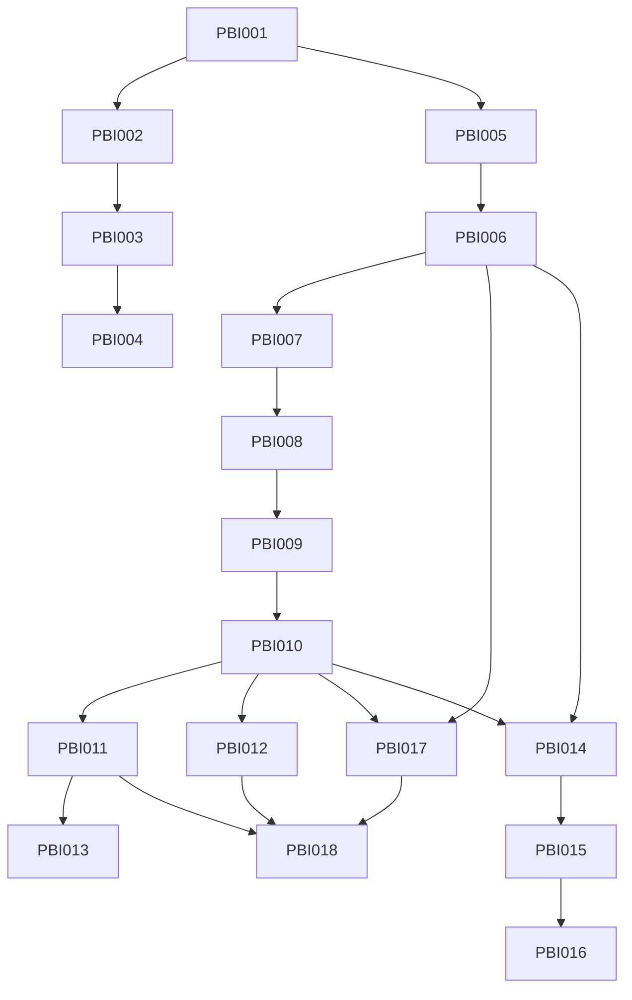

# Plans — SWE Drip

> Sequencing index for `asdlc-plan` / `asdlc-execute`. One PBI per task card; dependency graph drives Ralph Loop order.

## Plane sync

Bound to Plane: **kcb / SWDR (2af62f36-c11a-411a-89b5-8e5a5176b829)** — verified via MCP `plane-kcb` 2026-08-22.
Backlog ignored until moved to `Todo` — only `Todo` issues are candidate feature inputs. Coolify via MCP (not skills) per founder preference.

- 2026-08-22 00:20 UTC: pushed **18 `Todo` issues** to `kcb/SWDR` (PBI-001→SWDR-1 … PBI-006→SWDR-6, PBI-007→SWDR-8 … PBI-018→SWDR-19; SWDR-7 was a probe and deleted)
- Live: `plane-kcb_workitem.list` `project=SWDR` `per_page=50` now returns 18 `Todo` (state `af5a4650-8100-4f5a-9a1b-1dacb65cb90f`)
- Next sync: `asdlc-plan` will pull `Todo` before authoring further PBIs; `asdlc-plane` strictly scoped to `kcb/SWDR`

## Full plan — 6 specs, 18 PBIs covering all 7 docs (complete before execution)

> **Complete** per `docs/01-brand` through `docs/07-scale` — no execution until every spec below is human-reviewed. `coolify-deploy` is Phase 1 (ship the artifact), Phases 2–6 materialize the 11-agent factory described in `docs/03-agents` + `docs/06-traffic` flywheel + `docs/05-launch`/`docs/07-scale` gates.

### Spec index

| Spec dir | Docs truth | Contracts | PBIs |
|---|---|---|---|
| `specs/coolify-deploy/spec.md` | `02-stack` infra + `04-deploy` Day 1–7 (kcb / swedrip.kcb.ma) | 6 (container, Coolify app kcb, domain swedrip.kcb.ma TLS, health, no secrets, one-click redeploy) | PBI-001…004 |
| `specs/platform-workspace/spec.md` | `04-deploy` 1.6/1.11 + `03-agents` workspace + `01-brand` invariants | 6 (workspace schemas, program.md 60d dedupe + 500-line compact, CEO pure rules, brand lint, backup, Context Map honesty) | PBI-005…006 |
| `specs/content-pipeline/spec.md` | `01-brand` validation + `03-agents` Trend/Copy/Design/Listing + `02-stack` OpenRouter/Fourthwall MCP | 5 (Trend scoring >60, Copy ≤6w dupe-free, Design FLUX fallback PNG RGB <10MB, MCP generate→create-offers, Listing price 32/62/20 live confirm) | PBI-007…010 |
| `specs/distribution/spec.md` | `03-agents` Social/Video/Community + `06-traffic` calendar + 4:1 ratio | 5 (Social cron Tue/Wed/Thu + Buffer + hashtag/Reddit guards, Video Veo 8s poll 10s×60, Community 12h keyword + link/tone guards, flywheel input ordering) | PBI-011…013 |
| `specs/operations/spec.md` | `03-agents` Analytics/Email/Finance/CEO + `06-traffic` flywheel + `07-scale` drift/scale | 6 (weekly_report KPI + kill 0>30d scale 5<14d, Loops campaign, Finance Net% + escalations, CEO Telegram digest, program drift ≤500, scale math 21k visitors + unlock table) | PBI-014…016 |
| `specs/storefront/spec.md` | `01-brand` pricing/aesthetic/SEO + `02-stack` Brutal + `05-launch` checklist + `07-scale` expansion | 6 (Brutal CSS #0D0D0D/#00FF41, pricing invariant, SEO title ≤60 tags 8–12 tiers, launch gate 10 products/20 tweets/3 videos, PH/HN drafts, channel ratio lint) | PBI-017…018 |

### Execution order (recommended — dependency-declared, Ralph Loop picks next `Todo`)

| Order | PBI | Spec | Depends on | State | Plane | Files touched (blast radius) |
|---|---|---|---|---|---|---|
| 1 | PBI-001 | coolify-deploy | none | Done | kcb/SWDR-1 | `Dockerfile`, `nginx.conf`, `.dockerignore`, `package.json`, `scripts/*smoke*` |
| 2 | PBI-002 | coolify-deploy | PBI-001 | Done | kcb/SWDR-2 | `docs/adrs/ADR-002.md`, `.coolify/app.json` / `docs/coolify-provision.md`, `README.md`/`docs/04-deploy.md` |
| 3 | PBI-003 | coolify-deploy | PBI-002 | Done | kcb/SWDR-3 | `docs/adrs/ADR-002.md`, `.coolify/app.json`, `docs/04-deploy.md` |
| 4 | PBI-004 | coolify-deploy | PBI-003 | Done | kcb/SWDR-4 | `tests/deployment.test.js`, `scripts/verify-deploy.js`, `package.json`, runbook |
| 5 | PBI-005 | platform-workspace | PBI-001 | Done | kcb/SWDR-5 | `schemas/design_brief.schema.json`, `schemas/listing_copy.schema.json`, `workspace/`, `scripts/seed-workspace.js`, `tests/platform-workspace.test.js` |
| 6 | PBI-006 | platform-workspace | PBI-005 | Done | kcb/SWDR-6 | `agents/ceo/SKILL.md`, `program.md`, `scripts/append-program.js`, `scripts/compact-program.js`, `scripts/lint.js`, `tests/platform.test.js`, `AGENTS.md` §5 |
| 6.5 | PBI-019 | llm-config | PBI-005 | Done | kcb/SWDR-20 | gents/lib/config.js, gents/lib/provider.js, 	ests/llm-config.test.js, .coolify/app.json |
| 7 | PBI-007 | content-pipeline | PBI-005, PBI-006, PBI-019 | Superseded | kcb/SWDR-8 | `agents/trend-scout/SOUL.md`, `agents/trend-scout/`, `workspace/fixtures/`, `tests/trend-scout.test.js` |
| 8 | PBI-008 | content-pipeline | PBI-007 | Superseded | kcb/SWDR-9 | `agents/copy/SOUL.md`, `agents/copy/`, `tests/copy-agent.test.js` |
| 9 | PBI-009 | content-pipeline | PBI-008 | Superseded | kcb/SWDR-10 | `agents/design/SOUL.md`, `agents/design/`, `workspace/designs/`, `tests/design-agent.test.js` |
| 10 | PBI-010 | content-pipeline | PBI-009 | Superseded | kcb/SWDR-11 | `agents/listing/SOUL.md`, `agents/listing/`, `tests/listing-agent.test.js` |
| 11 | PBI-011 | distribution | PBI-010 | Superseded | kcb/SWDR-12 | `agents/social/SOUL.md`, `agents/social/`, `workspace/social_state.json`, `tests/distribution-social.test.js` |
| 12 | PBI-012 | distribution | PBI-010 | Superseded | kcb/SWDR-13 | `agents/video/SOUL.md`, `agents/video/`, `workspace/reports/video_clips.json`, `tests/distribution-video.test.js` |
| 13 | PBI-013 | distribution | PBI-011 | Superseded | kcb/SWDR-14 | `agents/community/SOUL.md`, `agents/community/`, `workspace/community_log.json`, `workspace/fixtures/`, `tests/community.test.js` |
| 14 | PBI-014 | operations | PBI-010, PBI-006 | Superseded | kcb/SWDR-15 | `agents/analytics/SOUL.md`, `agents/analytics/`, `workspace/weekly_report.md`, `workspace/kill_list.md`, `tests/analytics.test.js` |
| 15 | PBI-015 | operations | PBI-014 | Superseded | kcb/SWDR-16 | `agents/email/SOUL.md`, `agents/finance/SOUL.md`, `agents/email/`, `agents/finance/`, `workspace/finance_report.md`, `tests/email-finance.test.js` |
| 16 | PBI-016 | operations | PBI-014, PBI-015, PBI-006 | Superseded | kcb/SWDR-17 | `agents/ceo/agent.js`, `scripts/compact-program.js`, `docs/adrs/ADR-003.md`, `tests/ceo-operations.test.js` |
| 17 | PBI-017 | storefront | PBI-006, PBI-010 | Superseded | kcb/SWDR-18 | `storefront/brutal.css`, `storefront/seo.js`, `scripts/lint.js`, `tests/storefront.test.js`, `tests/seo.test.js` |
| 18 | PBI-018 | storefront | PBI-017, PBI-011, PBI-012 | Superseded | kcb/SWDR-19 | `scripts/verify-launch.js`, `ph_hunt_draft.md`, `show_hn_draft.md`, `scripts/lint.js`, `package.json`, `tests/launch.test.js` |

_Keep sorted by execution order; `State` moves Todo → In Progress → In Review → Done via `asdlc-execute`. SWDR-7 was a probe and deleted — PBI-007 maps to SWDR-8 (skip intentional)._

### Dependency graph

```
Phase1 infra:
PBI-001 (Docker) -> PBI-002 (Coolify app kcb) -> PBI-003 (domain swedrip.kcb.ma TLS) -> PBI-004 (verify/runbook)

Phase2 platform:
PBI-001 -> PBI-005 (workspace schemas+seed) -> PBI-006 (CEO rules + program.md + brand lint)

Phase3 pipeline (critical path):
PBI-005+PBI-006 -> PBI-007 (Trend Scout) -> PBI-008 (Copy) -> PBI-009 (Design FLUX) -> PBI-010 (Listing verify live)
                |                                                        |
                +-> PBI-017 (storefront CSS/SEO) waits PBI-006+PBI-010 --+

Phase4 distribution:
PBI-010 -> PBI-011 (Social cron+Buffer) -> PBI-013 (Community)
      \-> PBI-012 (Video Veo) parallel with 011

Phase5 operations:
PBI-010+PBI-006 -> PBI-014 (Analytics) -> PBI-015 (Email+Finance) -> PBI-016 (CEO loop+drift+scale)

Phase6 launch:
PBI-017 (storefront) + PBI-011 + PBI-012 -> PBI-018 (launch gate + PH/HN drafts)
PBI-016 (CEO/scale) also gates launch readiness (weekly_report math)
```

Mermaid:



_Notes: PBI-011 and PBI-012 are parallel after PBI-010; PBI-013 waits PBI-011 to avoid concurrent `community_log.json` / `social_state.json` conflict; PBI-017 can run parallel to PBI-007..016 once PBI-006 done but is sequenced late to keep review linear for this plan._

### Gate plan (deterministic + review + human — per `AGENTS.md:18`)

- **Deterministic gates (must pass before `In Review` — `cmd /c "npm run verify"`):**
  ```
  cmd /c "npm run build"  → build: docs-only repo, no compilation required
  cmd /c "npm run lint"   → lint: all docs OK + brand-invariant guard + Context Map honesty + storefrontCssCheck + verify-deploy checks (Dockerfile/nginx/app.json) + launchRules
  cmd /c "npm test"       → node --test tests/*.test.js (8 smoke + 18 new suites, all offline mocked; deployment/launch probes skip without DEPLOY_URL/network — never fail local)
  cmd /c "npm run verify" → build && lint && test  (Ralph Loop gate)
  ```
  Added by this full plan: `scripts/verify-deploy.js` (PBI-004, Dockerfile/nginx/.coolify), `scripts/seed-workspace.js` (PBI-005), `scripts/append-program.js`/`compact-program.js` (PBI-006), `scripts/verify-launch.js` (PBI-018, skipped until launch_readiness.json present), and `tests/platform*.test.js`, `tests/*-agent.test.js`, `tests/distribution*.test.js`, `tests/analytics.test.js`, `tests/email-finance.test.js`, `tests/ceo*.test.js`, `tests/storefront.test.js`, `tests/seo.test.js`, `tests/launch.test.js`.

- **Review gates (critic agent vs Spec per PBI Verification section):**
  - Spec contracts 1-6 per spec × PBI (see each `specs/*/spec.md` §Contracts + `tasks/PBI-*.md` Verification)
  - Brand invariants still `#0D0D0D/#00FF41/#FF6B35/JetBrains Mono/$32/$62/$20` + anti-patterns (no gradients/shadows/hustle) on every PBI
  - No secrets baked (`docker history` + env grep) on PBI-001/002, no hashtags / no Reddit body link on PBI-011/018, no Telegram spam on operations

- **Human gates (`manual` sort until founder validates):**
  - Q1-Q4 (Coolify admin on kcb, DNS swedrip.kcb.ma → kcb IP, registry vs Git-direct, volume placeholders) — PBI-002/003 `manual` until DNS + Coolify access confirmed via `curl https://swedrip.kcb.ma/health` + `openssl s_client` issuer check outputs
  - OpenRouter/FLUX live render + Fourthwall MCP live preview (PBI-009) — `manual` with `product_url` screenshot
  - Buffer/Loops/Telegram live delivery (PBI-011/015) — `manual` with queued-count / drafts-held evidence
  - Launch gate (PBI-018) — `manual` until PH/HN drafts approved and 10-product/20-tweet/3-video checklist is physically verified on `kcb`

### Tooling (capability discovery — full plan)

- **Coolify:** MCP server `plane-kcb` already verifies binding; **Coolify MCP** (`freqkflag/coolify-mcp-server` or `ajmcclary/coolify-manager` as MCP, not skill) is the execution seam for `kcb` (server `kcb`, project `swe-drip`, app `swedrip`). Per founder request: **no skill installed** — all Coolify ops via MCP `https://plane-mcp.kcb.ma/http/api-key/mcp` with `X-Workspace-slug: kcb` + direct Coolify API (`https://<coolify-host>/api/v1/...`, `Authorization: Bearer $COOLIFY_API_KEY`).
- **OpenRouter:** `https://openrouter.ai/api/v1` (`OPENROUTER_API_KEY` ≡ `OPENAI_API_KEY` + `OPENAI_BASE_URL`) — LLM `claude-sonnet-4-6`/`gemini-flash`/`haiku` + image `flux.2-pro` (+ fallback `gemini-3.1-flash-image`) + video `veo-3.1-lite` — unified spend cap $130 (per-agent caps in docs/03-agents)
- **Fourthwall MCP:** `https://mcp.fourthwall.com` OAuth `FOURTHWALL_MCP_TOKEN` — tools `ecommerce_*` + `brand_from_url` (mocked in `npm test`, live in `manual` review)
- **Loops.so / Buffer / Telegram:** `https://app.loops.so/api/v1` (`LOOPS_API_KEY`), `https://api.bufferapp.com/1` (`BUFFER_ACCESS_TOKEN`), `https://api.telegram.org/bot.../sendMessage` (`TELEGRAM_BOT_TOKEN`/`TELEGRAM_CHAT_ID`) — mocked in gates, live evidence in `manual` comments
- **No third-party planning skill adopted** — methodology is ASDLC-only as requested; discovery table in `specs/coolify-deploy/spec.md:60` remains candidates for reference.

### Plane sync (push-create — §6b) — DONE

- 18 `Todo` issues created 2026-08-22 via `x-api-key` REST (`plane.kcb.ma/api/v1`) with `X-Workspace-slug: kcb` (probe SWDR-7 created+deleted, sequence skipped to SWDR-8)
- Every `tasks/PBI-*.md` now carries `Plane: kcb/SWDR-N (Todo — <uuid>)` in its Context — see file headers
- Future PBIs: run `asdlc-plane` pull before authoring (Backlog ignored) and push-create will append `Todo` issues skipping already-linked PBIs


## Phase 7 — Paperclip org bootstrap + Fourthwall store (ADR-003, founder-directed)

Specs: `specs/paperclip-org/spec.md` + `specs/fourthwall-store/spec.md`. Architecture decision: agents execute **inside the deployed Paperclip** (`paperclip.kcb.ma`, OpenRouter wired via env) under a new `SWE Drip` organization; store is **Fourthwall-hosted** operated via Fourthwall MCP (`https://mcp.fourthwall.com`, OAuth). PBIs 007–018 are superseded by this path (contracts absorbed into SOUL.md content); files remain as reference. See `docs/adrs/ADR-003.md`.

### Execution order

| Order | PBI | Spec | Depends on | State | Plane | Summary |
|---|---|---|---|---|---|---|
| 19 | PBI-020 | paperclip-org | none | Done | kcb/SWDR-21 | Materialize 11 SOUL.md files + souls lint gate |
| 20 | PBI-021 | paperclip-org | none | Done | kcb/SWDR-22 | Create SWE Drip organization in Paperclip |
| 21 | PBI-022 | paperclip-org | PBI-021 | In Review | kcb/SWDR-23 | Hire CEO agent (Sonnet, $30/mo) + test cycle |
| 22 | PBI-023 | fourthwall-store | PBI-021 | In Progress | kcb/SWDR-24 | Connect Fourthwall MCP in Paperclip + OAuth smoke |
| 23 | PBI-024 | paperclip-org | 020, 023 | Done | kcb/SWDR-25 | Hire pipeline workers (Trend/Copy/Design/Listing) |
| 24 | PBI-025 | paperclip-org | 020, 023 | Done | kcb/SWDR-26 | Hire distribution+ops workers (6) |
| 25 | PBI-027 | fourthwall-store | PBI-023 | Done | kcb/SWDR-28 | Storefront design live (Brutal theme, CSS, collections, online) |
| 26 | PBI-028 | both | 024, 026/027 | Superseded | kcb/SWDR-29 (deleted 2026-08-24) | First product E2E — superseded by Phase 8 (PBI-037) |

> PBI-030 (tool binding + model upgrade) and PBI-031 (Hermes callback + heartbeat) existed as Plane issues only (no task files) and were predicated on the broken stack — deleted from Plane 2026-08-24; re-derived inside Phase 8 PBI-034/035.

### Dependency graph

```
PBI-020 (souls) ─────────┐
PBI-021 (org) ─► PBI-022 (hire CEO)
      └───────► PBI-023 (FW MCP + OAuth) ─► PBI-024 (pipeline hires) ─┐
                              │             └► PBI-025 (dist+ops hires)│
                              └► PBI-027 (storefront design)          ├► PBI-028 (first product E2E)
                                            (PBI-025 also feeds E2E) ─┘
```

Manual-sort note: PBI-021..028 are Paperclip-UI/Fourthwall-dashboard operations — verification evidence is screenshots/task-board outputs attached to Plane issues (founder or agent-in-browser). PBI-020 is fully agentic.


## Phase 8 — Agent stack rebuild (ADR-004, 2026-08-24)

Supersedes the fragmented Phase 7 runtime (root causes: nonexistent `paperclipai/paperclip` image, wrong Hermes `/opt/data` mount, non-first-class `hermes_gateway` + insecure-HTTP guard, OpenRouter 402 from 128k max_tokens, cross-project/network split). Spec: `specs/agent-stack/spec.md`. One compose = `postgres` + `paperclip` (from source) + `hermes` gateway. Stale PBI-028/030/031 removed from Plane 2026-08-24.

### Execution order

| Order | PBI | Spec | Depends on | State | Plane |
|---|---|---|---|---|---|
| 32 | PBI-032 — Author stack compose + hermes config + lint gate | agent-stack | none | Done | kcb/SWDR-32 |
| 33 | PBI-033 — Provision stack on Coolify (UI, single compose service) | agent-stack | PBI-032 | Done | kcb/SWDR-33 |
| 34 | PBI-034 — Wire 11 agents → hermes_gateway + CEO test cycle | agent-stack | PBI-033 | Done | kcb/SWDR-34 |
| 35 | PBI-035 — Full-power verify (memory persist, prod models, max_tokens) | agent-stack | PBI-034 | Active | kcb/SWDR-35 |
| 36 | PBI-036 — FW product-creation fix (image upload 403) | fourthwall-store | none | Proposed | kcb/SWDR-36 |
| 37 | PBI-037 — First product E2E (replaces stale PBI-028) | agent-stack + fourthwall-store | PBI-034, PBI-036 | Proposed | kcb/SWDR-37 |

### Dependency graph

```
PBI-032 -> PBI-033 -> PBI-034 -> PBI-035 -> PBI-037
PBI-036 (independent) ----------------------> PBI-037
```

### Gate plan (Phase 8)

- Deterministic: `npm run verify` — PBI-032 adds agent-stack lint gate + `tests/agent-stack.test.js`; grep gate forbids `sk-or-`/64-hex secrets in `deploy/`.
- Review gates: critic validates compose + config against agent-stack contracts 1–3; adversarial on the lint additions.
- Human gates (`manual`): PBI-033 (Coolify UI provisioning — founder executes, verified via Coolify MCP), PBI-034/035 (live runtime), PBI-036 (live Fourthwall), PBI-037 (first product + founder design approval). PBI-032 is agentic (deterministic, no live/production impact).


## How to add a PBI (via asdlc-plan)

1. Move Plane issue to `Todo` (or create one) — `asdlc-plane` syncs it here as candidate
2. Run `asdlc-plan` — it writes `specs/{feature}/spec.md` and `tasks/PBI-XXX.md`
3. `asdlc-plan` updates this table with the PBI and its dependencies
4. `asdlc-execute` picks the next `Todo` → `In Progress` PBI and runs the Ralph Loop

## Spec Reversing reminder

Never start a PBI on brownfield code without a reversed, human-reviewed Spec (`specs/{feature}/spec.md` — behavior, not code narration). Bugs documented as features are defects.
